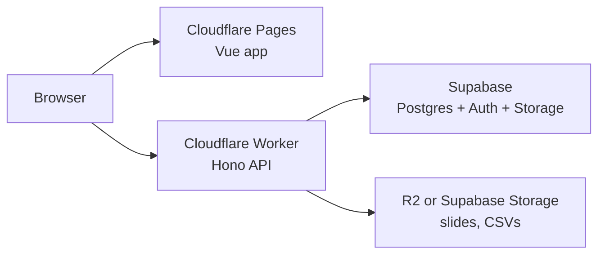

# Cloudflare Pages/Workers + Supabase Deployment Notes

> **Combined website update (2026-07-10):** This document records the standalone Events Management deployment design. For the new website-parent integration, [website-integration/architecture.md](./website-integration/architecture.md) supersedes the Pages/Worker topology, and [website-integration/supabase-foundation.md](./website-integration/supabase-foundation.md) is the audited database migration plan. Supabase remains the durable backend; the combined Astro product uses Worker Static Assets plus selective Worker compute.

> **Classic Quiz retirement (2026-10-03):** References below to the classic Quiz, global leaderboard, PDF-to-quiz generation, and Durable Object quiz rooms are historical proposals and are superseded. They are not active deployment, configuration, or phase-one guidance. The retained System Design learning room is a separate organizer-led workflow that currently uses its database-backed runtime with polling; this document does not prescribe a Durable Object deployment for it.

This is the proposed heavy-duty deployment path for DevCon-Comm once we move the app from local JSON files to Supabase as the source of truth.

The target shape is:

- Cloudflare Pages hosts the built Vue app.
- Cloudflare Workers host the HTTP API and route requests to Supabase.
- Supabase stores durable product data: events, talks, speakers, feedback, attendance imports, System Design learning-room data, users, and admin roles.
- Cloudflare R2 or Supabase Storage stores slide decks, exported CSV files, and downloadable resources.


```mermaid
flowchart LR
  browser["Browser"] --> pages["Cloudflare Pages\nVue app"]
  browser --> api["Cloudflare Worker\nHono API"]
  api --> supabase["Supabase\nPostgres + Auth + Storage"]
  api --> storage["R2 or Supabase Storage\nslides, CSVs"]
```

## Why This Shape

Supabase remains the durable backend for the active event-management product and the retained System Design learning rooms. The older Durable Object live-quiz design is retained below only as historical context.

## Do We Need To Pay For Starters?

For early local and small remote testing, probably no.

- Cloudflare Pages static hosting can start on the free plan.
- Pages Functions count against Workers usage. Cloudflare documents a Workers Free request allowance, and static asset requests do not count as Functions.
- Supabase has a free plan suitable for initial wiring and test data.

For serious rehearsal or public launch, yes, budget for paid plans.

- Cloudflare Workers Paid has a small monthly minimum and higher limits.
- Supabase Pro is the first sensible production tier because it avoids free-tier project pausing/resource constraints and gives more predictable operations.
- If uploads or generated resources grow, add R2 or Supabase Storage budgeting.

Practical read: use free tiers for proof-of-architecture and internal testing. Move to paid before an actual public meetup where feedback, slide links, System Design learning rooms, and admin workflows must be reliable.

## Free-First Plan For A Non-Funded Group

DevCon can start with a deliberately constrained setup and only pay when the usage proves it is needed.

Start here:

- Cloudflare Pages free for the Vue frontend.
- Cloudflare Workers free for light API traffic, if the Worker adapter is ready.
- Supabase Free for Postgres, auth testing, public meetup data, feedback, event CRUD, and small storage.
- Keep attendance imports active with Luma CSV files capped at `2 MB`.
- Use external slide links first: Google Drive, Speaker Deck, GitHub, Notion, or public PDF links.

This means the first funded line items can be delayed until there is a real pressure point:

| Trigger | Move to paid |
|---|---|
| Public meetup needs dependable admin/event data | Supabase Pro |
| Uploads exceed small free storage limits | R2 or Supabase Storage usage budget |
| Website integration gets meaningful traffic | Cloudflare/Supabase cache and limit review |

For now, the cheapest sensible product rule is: store links instead of files, keep CSVs small, defer realtime, and prefer manual organizer workflows before automation.

## Revised Hosting Options After Phase-One Scope Cut

Phase one does not include the retired classic Quiz, leaderboard, or PDF-to-quiz features. It needs:

- public Vue pages
- organizer event CRUD
- speaker CFP and slide-link submission
- attendance CSV imports capped at `2 MB`
- feedback forms
- the retained System Design learning-room runtime, using its current database-backed polling flow
- a stable public endpoint for `devcongress.org`

That makes the hosting decision simpler. We do not need to optimize for realtime yet; we need cheap, boring, externally consumable HTTP.

### Option A: Cloudflare Pages + Cloudflare Worker + Supabase

Recommended phase-one target.

Use Cloudflare Pages for the Vue build, a Worker for `/api/*`, and Supabase for Postgres/Auth/storage-light data.

Good fit because:

- static frontend hosting is cheap/free-friendly
- `/api/public/meetups*` can sit close to the edge
- no always-on server is required once the Hono app has a Worker entrypoint

Tradeoffs:

- we must adapt the current Bun/Hono server into a Worker-compatible entrypoint
- all local file persistence must be gone before production

Best for: the public website integration plus low-cost community operations.

### Cloudflare Phase-One Deploy Steps

Deploy the frontend first with Cloudflare Pages:

| Setting | Value |
|---|---|
| Framework preset | `None` |
| Build command | `pnpm build` |
| Build output directory | `dist` |
| Root directory | `/` |

Pages environment variables:

| Variable | Value |
|---|---|
| `VITE_SUPABASE_URL` | Supabase project URL |
| `VITE_SUPABASE_ANON_KEY` | Supabase anon key |
| `VITE_ADMIN_BASE_PATH` | Organizer base path, for example `/organizer-console` |
| `VITE_SHOW_ORGANIZER_LINK` | `true` or `false` |
| `VITE_API_BASE_URL` | Worker URL, for example `https://events-management.admins-a7d.workers.dev` |

Deploy the API Worker separately:

```bash
pnpm install
pnpm deploy:worker
```

`wrangler.toml` pins the DevCongress Cloudflare account so a local deployment cannot select another logged-in account when Wrangler sees multiple accounts.

Worker secrets and variables:

```bash
npx wrangler secret put SUPABASE_SERVICE_ROLE_KEY
npx wrangler secret put VITE_SUPABASE_URL
npx wrangler secret put VITE_SUPABASE_ANON_KEY
```

Use the service-role key only on the Worker. Do not add `SUPABASE_SERVICE_ROLE_KEY` to Cloudflare Pages environment variables. Keep public Worker origins such as `PUBLIC_APP_URL` and `PUBLIC_FRONTEND_ORIGIN` in `wrangler.toml` so deploys do not remove dashboard-only variables.

The Worker uses one minute-level cron trigger with an isolated route dispatch per invocation. The volunteer follow-up drain receives four processing opportunities in each 15-minute cycle (slots 0, 9, 11, and 13); the three unused slots remain idle. This is a delivery ceiling, not a four-invitation guarantee: each invocation can process at most one invitation or outcome, and the existing 15-minute wall-clock fairness windows alternate invitation and outcome priority while shared 54/day limit, 35-message reserve, leases, and idempotency controls still apply.

For organizer Google sign-in, also configure the Supabase Google provider and add `https://em.devcongress.org` plus the local Vite origin to the Google OAuth client. The Google Authorized redirect URI should be the Supabase callback URI shown in the provider settings, while the post-auth app redirect continues through `/api/auth/admin/callback`.

For the Pages deploy, keep browser API calls on the browser-facing hostname and let the committed `public/_worker.js` Pages advanced-mode worker proxy `/api/*` to the API Worker. This preserves the same-origin cookie contract for organizer auth while still serving the API from Workers. Set both `PUBLIC_APP_URL` and `PUBLIC_FRONTEND_ORIGIN` to `https://em.devcongress.org` in `wrangler.toml`; this also permits the custom-domain `Origin` header on state-changing organizer requests. Do not enable `VITE_FORCE_API_BASE_URL` for normal organizer testing. Use `VITE_FORCE_API_BASE_URL=true` only for explicit split-origin smoke tests where cookie auth is not being exercised.

### Option B: Cloudflare Pages + Supabase Edge Functions

Viable, but not the default.

Use Cloudflare Pages for the Vue app and Supabase Edge Functions for API endpoints.

Good fit because:

- everything data-related stays in Supabase
- fewer hosting providers
- useful for auth-adjacent backend logic

Tradeoffs:

- it creates a second API runtime shape from the current Hono app
- local parity with the current Bun/Hono server is weaker

Best for: teams that want Supabase to own almost all backend behavior.

### Option C: Render Web Service + Supabase

Good temporary bridge.

Deploy the current Bun/Hono app as a web service and point `devcongress.org` to its public API endpoints.

Good fit because:

- minimal rewrite from the current server shape
- faster to get the whole app online
- easy mental model: one running web service plus Supabase

Tradeoffs:

- free web services have production-unfriendly limitations
- cold starts/sleeping are bad for public APIs if using free instances

Best for: proving the full app quickly before doing the Worker split.

### Option D: Vercel Frontend/API + Supabase

Possible, but not preferred for this app.

Good fit because:

- easy frontend deploy flow
- good preview deployments
- enough for basic HTTP endpoints

Tradeoffs:

- current Bun server still needs adapter work

Best for: if the team already standardizes on Vercel and accepts external realtime later.

### Option E: Fly.io/Small VM + Supabase

Powerful, but not free-first.

Good fit because:

- can run the current server model cleanly
- useful later for background jobs or long-running workers

Tradeoffs:

- not a true free-tier comfort zone
- easier to create small surprise costs
- overkill for phase-one CRUD and public endpoint hosting

Best for: later worker services, not the main phase-one host.

## Hosting Recommendation

Choose Option A as the target: Cloudflare Pages + Cloudflare Worker + Supabase.

Use Option C only as a short bridge if we need to show the full app online before the Worker adapter is ready.

Decision:

- Phase one target: Cloudflare Pages + Worker + Supabase.
- Bridge path: Render web service + Supabase if speed matters more than final shape.
- Keep `devcongress.org` integration through `/api/public/meetups*`, not through shared database access.

Why:

- cheapest credible path
- stable public API for another app
- avoids paid realtime before it is needed
- avoids Firebase migration cost

Revisit when:

- public API traffic exceeds Cloudflare/Supabase free limits
- attendance CSV imports become too large or sensitive for current handling
- DevCon gets funding and wants always-on production support/backups

## Free-First Feature Policy

### Events

Use Supabase as source of truth. Events, talks, speakers, feedback campaigns, attendance summaries, and public meetup feed data should live in Postgres.

### Slides

Use slide links only in phase one. This avoids storage costs, malware scanning concerns, and upload edge cases.

Speakers should provide public URLs from Google Drive, Speaker Deck, GitHub, Notion, personal sites, or any stable public slide host. The app stores the URL and timestamp, not the file.

Revisit file storage only if link-only sharing becomes a real friction point.

### Attendance CSVs

Keep attendance imports. This is a useful organizer feature and the files are small.

- Accept Luma CSV exports only.
- Cap CSV files at `2 MB`.
- Store one current CSV per meetup month/event.
- Let organizers replace or remove the attached CSV.
- Use the imported data for attendance readouts and venue-planning trends.

### Retired Classic Quiz Proposals

The classic Quiz, global leaderboard, and PDF-to-quiz proposals that previously appeared here are historical and superseded by the 2026-10-03 product decision. Do not enable, configure, or plan deployment capacity for them. This retirement does not remove the separate System Design learning-room workflow described in [features/system-design-learning-room.md](./features/system-design-learning-room.md).

## Firebase Comparison

Firebase is worth considering, but switching now does not obviously lower pressure.

### Where Firebase Helps

- Very fast app setup for auth, hosting, Firestore, and realtime-style client updates.
- Firestore is generous enough for early structured data if the model is document-friendly.
- Firebase Hosting has a useful free starting posture.
- Firebase's local emulator suite is strong for avoiding accidental test costs.

### Where Firebase Hurts This App

- The app already has Supabase integration and migrations started.
- The public meetup API and organizer data model are relational: events, talks, speakers, feedback, attendance, users, System Design learning-room data, and submissions. Postgres fits this better than Firestore documents.
- Firebase Storage now requires the pay-as-you-go Blaze plan for new/default bucket use, even though no-cost usage can still apply within allowances.
- Cloud Functions for Firebase are a Blaze/pay-as-you-go surface, so a backend-heavy app still needs billing enabled.
- Firestore billing is usage-metered by reads, writes, deletes, storage, and network. That can stay cheap, but it is easier to accidentally make expensive with chatty screens.

### Recommendation

Do not switch to Firebase just to save money.

Keep Supabase + Cloudflare as the default free-first path because:

- Supabase gives us Postgres, which matches the app's event-management model.
- Cloudflare gives us very cheap static/API hosting.
- We can postpone storage and realtime spend until the product actually needs them.

Firebase would be more attractive if this were a greenfield mobile-first app with simple document data and Firebase-native realtime screens. For this app, switching would create migration cost without a clear cost win.

## Current App Readiness

The app is close conceptually, but not ready for direct Cloudflare deployment yet.

Current shape:

- Vue/Vite frontend can be built for static hosting.
- Hono API is fetch-native, which is a good starting point for Workers.
- Production server currently uses `Bun.serve` in `server/index.ts`.
- Most core data still uses JSON files under `data/` via `lib/mock-db`.

Cloudflare blockers to clear first:

- Replace JSON file persistence with Supabase tables.
- Add a Worker-compatible API entrypoint that exports `fetch`.
- Remove `Bun.file`, local filesystem writes, and process-local assumptions from production paths.
- Move uploads to direct-to-storage flows.

## Phase 1: Supabase Source Of Truth

Goal: keep the current local app shape, but make production data durable.

1. Create Supabase tables for events, talks, speakers, System Design learning-room sessions/questions/participants/responses, feedback campaigns, feedback submissions, attendance imports, users, and admin roles.
2. Port the existing JSON-backed repository functions to Supabase-backed repository functions.
3. Keep API response contracts stable so the Vue app and `devcongress.org` integration do not care where data comes from.
4. Store slide URLs only; avoid slide file storage in phase one.
5. Add row-level security policies, service-role-only admin mutations, and public read policies for website-published meetups.
6. Keep `/api/public/meetups*` as the website integration contract.

Exit check:

- `pnpm typecheck`
- `pnpm build`
- `pnpm verify:public-api`
- `/api/health/supabase` returns `ok: true`
- Create, update, publish, and read an event from Supabase-backed APIs.
- Import a `2 MB` or smaller attendance CSV and reject larger files.

## Phase 2: Cloudflare App Split

Goal: separate static frontend hosting from Worker API hosting.

1. Add a Cloudflare Worker entrypoint, for example `server/worker.ts`, that exports `default { fetch: app.fetch }`.
2. Keep `server/index.ts` for local Bun serving until the Worker path is proven.
3. Add Cloudflare config with:
   - build command: `pnpm build`
   - output directory: `dist`
   - API Worker bindings for Supabase environment variables
4. Configure Pages routing so `/api/*` goes to the Worker and all other routes fall back to the Vue app.
5. Store secrets in Cloudflare, not in the repo:
   - `VITE_SUPABASE_URL`
   - `VITE_SUPABASE_ANON_KEY`
   - `SUPABASE_SERVICE_ROLE_KEY`
6. Test preview deploys before binding the production domain.

Exit check:

- Public pages load from Cloudflare Pages.
- `/api/health` works through the Worker.
- `/api/public/meetups` is reachable from outside the app.
- Organizer routes still require admin authentication.
- No production path depends on local files.

## Historical Phase 3: Classic Quiz Durable Objects

This phase described the retired classic Quiz and global leaderboard. It is superseded and must not be implemented, configured, or treated as a future phase. The retained System Design learning rooms currently use their own database-backed polling runtime; see [features/system-design-learning-room.md](./features/system-design-learning-room.md).

## Phase 4: Uploads And Generated Resources

Goal: avoid piping large files through the app server.

For slides and other event resources:

1. User requests an upload URL from the API.
2. API checks permissions and returns a signed upload URL.
3. Browser uploads directly to Supabase Storage or R2.
4. API stores the final file metadata and public/private access rules in Supabase.

## Phase 5: DevCongress.org Integration

Goal: let `devcongress.org` consume meetups without depending on this app's UI.

1. Keep `/api/public/meetups` as the stable read-only feed.
2. Add CORS and short public caching for website consumption.
3. Add a `source_updated_at` or `updated_at` field so the website can cache safely.
4. Keep draft/private events out of the public feed.
5. Later, point `meetup.devcongress.org` to this app when the product is ready to stand alone.

The subdomain idea is sound. Use the API integration first, then move to the subdomain once the app has production auth and storage stability.

## Local Setup Checklist

1. Install dependencies:

```bash
pnpm install
```

2. Create `.env.local`:

```bash
VITE_SUPABASE_URL=...
VITE_SUPABASE_ANON_KEY=...
SUPABASE_SERVICE_ROLE_KEY=...
APP_DATA_SOURCE=supabase
```

3. Run Supabase migrations from `supabase/migrations`.
4. Start the app:

```bash
pnpm dev
```

5. Verify Supabase:

```bash
curl http://localhost:3000/api/health/supabase
```

6. Verify the website integration API:

```bash
pnpm verify:public-api
```

## Cloudflare Setup Checklist

1. Create a Cloudflare account.
2. Create a Pages project connected to the app repo.
3. Set:
   - build command: `pnpm build`
   - output directory: `dist`
4. Create a Worker for `/api/*`.
5. Add environment variables and secrets to Cloudflare.
6. Add R2 bucket if we choose R2 for uploads.
7. Configure preview and production routes.
8. Test preview URL with:
   - `/`
   - `/events`
   - `/api/health`
   - `/api/public/meetups`
   - organizer login
   - retained System Design learning-room presentation and participant join

## Cost Posture

Early testing can start at `0 USD/month` if usage stays inside Cloudflare and Supabase free limits.

Recommended public-launch baseline:

| Item | Why | Expected starting cost |
|---|---|---:|
| Cloudflare Workers Paid | More predictable Worker capacity | about `5 USD/month` minimum |
| Supabase Pro | Production database baseline | about `25 USD/month` before larger compute |
| R2 or Supabase Storage | Slides, papers, CSVs, public resources | usually low early; usage-based |

Launch expectation: about `30-60 USD/month` before heavier compute and storage. Budget higher if event resources or public API traffic grow.

## Official Pricing References

- Cloudflare Workers pricing: https://developers.cloudflare.com/workers/platform/pricing/
- Cloudflare Pages Functions pricing: https://developers.cloudflare.com/pages/functions/pricing/
- Cloudflare R2 pricing: https://developers.cloudflare.com/r2/pricing/
- Supabase pricing: https://supabase.com/pricing

Pricing and free-tier limits can change, so re-check these pages before committing to a launch budget.
