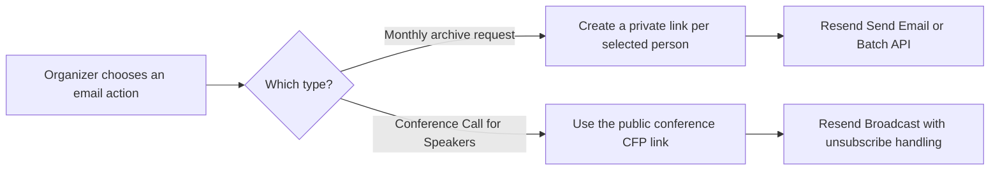

# Event Archive Email Delivery with Resend

## Status

Implemented for organizer-triggered monthly Archive Requests. Organizers can select up to 100 eligible program rows, and the Worker sends one personalized, private-link email per row through Resend's Batch API.

Resend acceptance, safe retry, duplicate-send prevention, and organizer toasts are active. Provider delivery webhooks, scheduled reminders, and annual-conference Broadcasts remain future work.

## Decision

The two email types need separate delivery paths because they have different recipients, links, and unsubscribe requirements.

| Email type | When it is sent | Link type | Resend feature | First release |
|---|---|---|---|---|
| Monthly Event Archive request for a talk or product demo | After DevCongress selects or otherwise confirms a participant | One unique, private, expiring form link per program item | Resend Batch API | Implemented organizer multi-select |
| Annual-conference Call for Speakers | Outreach before a person has submitted | One public conference CFP link shared by the campaign | Resend Contacts + Broadcasts with unsubscribe handling | Resend dashboard first; app integration later |

The monthly request is a direct operational follow-up to a selected person. The conference Call for Speakers is broader outreach and should not be forced through the transactional archive-request endpoint. Resend makes the same distinction in its [transactional versus marketing guidance](https://resend.com/docs/knowledge-base/what-sending-feature-to-use).



## What the Application Already Has

### Monthly proposals and the Event Archive

- The organizer-facing destination is **Event Archive**. Its items have a `kind` of `talk` or `product_demo`; the existing `Talk` model, routes, and public field names remain as a compatibility layer.
- Existing records without `kind` are read as `talk`.
- A public monthly speaker proposal becomes a `SpeakerSubmission`.
- Hosted proposals are private relational Supabase rows; normalized database uniqueness prevents concurrent Workers from accepting the same active event/kind/email/title proposal twice.
- Marking a proposal `selected` creates a speaker-bound `selected_speaker_confirmation` link.
- The selected-speaker form reuses the proposal's name, title, topic, abstract, and bio, then asks the speaker for the remaining slides URL.
- Completing that link creates the same archive-item/Talk compatibility record used by the manual path. It does not publish the item.
- The Proposals view already knows which participants are selected and which ones still need to complete their form.
- The separate Speakers allowlist supports event-scoped identity/access; it is not the archive and is not a source of public archive content.

Relevant code:

- [`AdminTalksView.vue`](../../src/views/admin/AdminTalksView.vue)
- [`speaker-submissions.ts`](../../lib/mock-db/speaker-submissions.ts)
- [`speaker-intake-links.ts`](../../lib/mock-db/speaker-intake-links.ts)
- [`SpeakerTalkIntakeView.vue`](../../src/views/SpeakerTalkIntakeView.vue)

### Program-based archive request

**Archive Requests** is off by default for every monthly event. An organizer explicitly selects **Enable archive requests** before the composer appears, so no private-link email can be sent by accident. Existing issued links remain visible and manageable while new requests are off. Welcome-address and system-design rows are excluded because they do not use the speaker archive-intake flow. Because the July program outline does not store speaker emails, the organizer enters one address for each selected row. The address is used for this one-off request and its identity-locked private link; it is not written back into the program outline or speaker allowlist. The selected program row remains the server-authoritative source of presenter name, talk title, and archive-item kind.

One submit creates a fresh `archive_backfill` link and sends a personalized email with the private URL behind a branded call-to-action. An already accepted program identity is suppressed; a failed provider attempt is deleted and a retry receives a new token because raw tokens are never recoverable. The email uses the public app's DevCongress wordmark, a near-black responsive body, and a neutral session card with the existing presentation-kit illustration. Yellow stays in image-based brand accents only; no live text is placed on a yellow email surface, so forced dark palettes cannot turn a yellow card into a low-contrast state. The private token stays exclusively in the CTA `href` and plain-text fallback. The session card truncates unusually long titles deterministically while the plain-text fallback retains the complete title. The private form presents that organizer-selected title as locked invitation context and omits it from the browser submission; the API always restores the title from the one-time link. The form collects the remaining topic, optional public resource URL, and concise fixed-height content fields: the abstract or demo summary is capped at 500 characters and the presenter bio at 300, with live counters and matching server validation. Inputs and the topic trigger use a quiet ink focus ring instead of a yellow halo, while the selected topic uses a restrained pink tint and checkmark. It reuses the existing archive path instead of introducing a second archive form.

### Private-link behavior

- Every recipient gets their own cryptographically random link.
- Links are scoped to one event, one recipient identity, and one archive-item kind.
- Links expire and close after one successful submission.
- Only the SHA-256 token hash is persisted. The raw bearer token exists only in the issuance response or outgoing email construction and cannot be recovered later.
- Hosted links use relational Supabase rows and atomic claim/consume/release functions so two Workers cannot complete the same link concurrently.
- The form cannot change the locked identity, event, kind, or title.
- Used, expired, deleted, anonymous legacy, cross-event, and type-mismatched links must not be emailed or accepted.

## Implemented Archive Prerequisites

### Product-demo proposals

The monthly CFP and July Archive Requests both accept `talk` or `product_demo`. The selected-presenter link inherits that kind and completes the same Event Archive record. The email layer should therefore accept the existing normalized source shape instead of introducing a separate product-demo proposal table:

```text
sourceType: speaker_submission | manual
sourceId: string | null
archiveItemKind: talk | product_demo
recipientName: string
recipientEmail: string
eventId: string
```

July uses `manual` with either archive-item kind. Later monthly editions use `speaker_submission` for selected talks and product demos.

### Monthly public CFP destination

The Vue router mounts the same-origin `/cfp/:eventId` form, and the organizer Archive constructs that URL for monthly events.

Before moving the form to `devcongress.org`, choose and verify the canonical website URL. That future move is a hosting decision, not a blocker for the monthly Archive or email pilot.

## Current Gap That Must Stay Visible

### Annual-conference CFP

The Annual Conference workspace currently has Overview, Work Plan, and Volunteers. Call for Speakers and the annual speaker form exist as work-plan tasks, not as a live public form or proposal store.

The conference CFP form and canonical public URL must be live before a Broadcast is sent. The monthly `/api/cfp` contract cannot be reused unchanged because it explicitly accepts only upcoming monthly events.

## Implemented: Program Multi-Send

### Organizer experience

In **Archive Requests**:

1. The organizer explicitly enables Archive Requests for the event; the server rejects direct creation calls while that per-event workflow remains off.
2. The organizer sees every eligible program speaker in one inline roster, with the speaker name, topic, selection control, and email field kept together instead of hidden in a dropdown.
3. Selecting a row activates its required email field; `Select all unsent` and `Clear selection` support the one-off bulk workflow.
4. Successfully sent rows are disabled and labelled `Sent`; the server enforces the same program-item suppression even if a different address is submitted later.
5. The organizer chooses the link lifetime; seven days remains the default.
6. `Send email` creates one fresh link per unsent selection and submits one personalized Resend batch.
7. A successful Resend response produces an `Email sent` or count-aware success toast. Configuration, network, and provider rejections use the same non-blocking error-toast surface instead of a persistent page banner. A rejected request remains retryable, but retry issuance creates a new raw token/link.

### Server behavior

The Hono API:

1. Require an authenticated organizer.
2. Validates the event, unique program indexes, organizer-supplied addresses, server-derived identity, archive-item kind, title, and expiry.
3. Suppresses an already accepted program identity; removes unused failed links and creates a fresh `archive_backfill` token for each retry.
4. Build the absolute private URL on the server from `PUBLIC_APP_URL`; never accept a link URL from the browser.
5. Render code-owned HTML and plain-text versions, retaining the private URL in the CTA link.
6. Stores `pending` delivery state on the link before calling Resend.
7. Sends up to 100 personalized entries with one deterministic idempotency key.
8. Stores each Resend email ID and marks the links `accepted` only when the full provider response is valid.
9. Records a safe failed state on provider rejection without logging recipient addresses, tokens, or URLs.
10. Audits the accepted batch count and suppresses later sends for the same program identity.

Submitting the private form creates an accepted or materials-received Event Archive item in the existing `Talk` compatibility model. It never publishes directly; an organizer must explicitly publish the item before it appears on public endpoints.

### Recommended July email

```text
Subject: Share your talk resources: {event name}

Hi {{ speakerName }},

Thanks for being part of {{ eventName }}.

We are completing the community archive for {{ talkTitle }}.

[Add my presentation details]

This link is for you only and expires {{ expiresAt }}.
Questions? Reply to this email.
```

The raw private URL is hidden behind the HTML call-to-action instead of passing the token through an external URL shortener. The plain-text fallback includes the URL so the message remains usable in text-only clients.

## Phase 2: Selected-Speaker Multi-Send

After the July single-send flow is stable:

1. Add checkboxes to the selected-participant list.
2. Let the organizer choose one, many, or `Select all eligible` selected participants.
3. Show a confirmation summary with eligible, already completed, expired-link, and missing-email counts.
4. Create one fresh link per eligible speaker while suppressing already accepted identities.
5. Render one personalized email per speaker.
6. Send the set through Resend's Batch API.
7. Show a per-person result instead of one ambiguous “batch sent” message.

Important rules:

- The action remains manual. No automatic send on selection and no reminders or scheduler in this phase.
- Never put several speakers in one `to`, `cc`, or `bcc` list.
- Never send the same private token to more than one person.
- Derive and lock each selected proposal's event, recipient identity, and archive-item kind on the server.
- Completion creates the same compatibility archive record as the July manual flow and still requires explicit organizer publication.
- A later product-demo selected list uses the same action after its submission source exists.
- Resend supports up to 100 individually personalized emails in one Batch API request. Each recipient still counts toward the plan quota, and every entry should be validated before the request. See [Batch Sending](https://resend.com/docs/dashboard/emails/batch-sending).

## Phase 3: Annual-Conference Call for Speakers

The conference email should use a public CFP link and Resend Broadcasts.

Recommended first release:

1. Build and publish the annual-conference CFP form on `devcongress.org`.
2. Confirm the form creates conference-scoped submissions and does not enter the monthly-only endpoint.
3. Prepare the recipient list from people DevCongress is allowed to contact.
4. Import or add them as Resend Contacts and place them in a conference-speaker segment.
5. Create the Call for Speakers in the Resend dashboard.
6. Include the public form URL and an unsubscribe link.
7. Send a test to organizers, review it, then manually send the Broadcast.

Resend Broadcasts handle contact unsubscribe state when the message includes the Resend unsubscribe placeholder. See [Managing Broadcasts](https://resend.com/docs/dashboard/broadcasts/introduction) and [unsubscribe guidance](https://resend.com/docs/knowledge-base/should-i-add-an-unsubscribe-link).

An in-app conference campaign screen can come later if organizers need the app to own drafts, segments, and send history. It should call the Broadcast API, not the monthly private-link endpoint.

The first dashboard-managed Broadcast does not require broader application credentials. If Broadcast and Contact management later moves into the app, create a separate least-privilege provider key for that integration rather than widening or reusing the transactional sending key.

## Resend Administrator Setup

### 1. Create the DevCongress Resend account or team

Use an organization-owned account so access is not tied to one developer.

### 2. Verify a dedicated sending subdomain

Recommended sender:

```text
Domain: updates.devcongress.org
Speaker From: DevCongress Speakers <speakers@updates.devcongress.org>
Reply-To: hello@devcongress.org
```

Resend recommends a subdomain to isolate sending reputation. In Resend, add `updates.devcongress.org`, then use its Cloudflare Domain Connect flow or add the supplied SPF/MX and DKIM records manually. Manual DKIM records must be DNS-only. Do not replace the root-domain Zoho mail records. Follow the official [Resend Cloudflare DNS guide](https://resend.com/docs/knowledge-base/cloudflare).

Before a DevCongress domain is verified, Resend's test `resend.dev` sender can only deliver to the address attached to the Resend account. Do not plan the real July send until the DevCongress sending subdomain is verified.

### 3. Create a restricted production API key

Create a key named `DevCongress Events Production` with:

```text
Permission: Sending access
Domain restriction: updates.devcongress.org
```

Resend displays a key only once. Store it immediately as a Worker secret and never expose it to Vue or any `VITE_` variable. Resend documents the available restrictions in [API Key Management](https://resend.com/docs/dashboard/api-keys/introduction).

### 4. Configure the existing Hono Worker

Active secret:

```text
RESEND_API_KEY
```

Non-secret bindings:

```text
SPEAKER_EMAIL_REPLY_TO=hello@devcongress.org
PUBLIC_APP_URL=https://em.devcongress.org
```

Production secret command:

```bash
pnpm exec wrangler secret put RESEND_API_KEY
```

The approved sender identity is code-owned in `lib/email/scenarios.ts`; the monitored Reply-To binding remains committed in `wrangler.toml`. Local Reply-To overrides belong in `.env.local`. `RESEND_WEBHOOK_SECRET` is not required until delivery webhooks are implemented.

No separate email Worker is required for July. The existing authenticated Hono Worker can call Resend directly. A queue/second worker becomes useful only when automatic retries, scheduled reminders, or materially higher volume are introduced. Resend has an official [Cloudflare Workers guide](https://resend.com/docs/send-with-cloudflare-workers).

### 5. Add a delivery webhook

Register:

```text
POST https://em.devcongress.org/api/webhooks/resend
```

Subscribe initially to:

```text
email.delivered
email.delivery_delayed
email.bounced
email.failed
email.suppressed
email.complained
```

The route is public but must verify the Resend signature against the raw request body using `RESEND_WEBHOOK_SECRET`. Webhooks are at-least-once and can arrive out of order, so deduplicate on `svix-id` and apply events using their timestamps. See [webhook signature verification](https://resend.com/docs/webhooks/verify-webhooks-requests) and [delivery guarantees](https://resend.com/docs/webhooks/introduction).

## Application Architecture

### Email module

Add:

```text
lib/email/resend.ts
lib/email/templates/monthly-archive-request.ts
lib/email/templates/conference-cfp-invite.ts
```

Use a small Worker-native REST client with code-owned HTML and text renderers. The client calls [`POST /emails/batch`](https://resend.com/docs/api-reference/emails/send-batch-emails), validates the ordered provider response, and avoids adding an SDK or React solely for email delivery.

### API surface

Active endpoint:

```text
POST /api/events/:eventId/speaker-intake-emails
body: {
  recipients: Array<{ program_item_index: number, speaker_email: string }>,
  expires_in_days: number
}
```

The browser supplies a stored schedule index and validated one-off email for each recipient, plus expiry. The server derives names, titles, event, and kind from the stored program, so the browser cannot replace the invited speaker/topic identity.

### Delivery records

Delivery metadata is stored with each relational link:

```text
email_status
email_provider_id
email_idempotency_key
email_sent_at
email_last_attempt_at
email_last_error
```

The Supabase link store is relational and hash-only. The raw token is emitted once, cannot be copied back out of storage, and is reissued as a new link after an unsuccessful provider attempt. The local JSON fallback follows the same hash-only token contract for development.

### Status language

`Accepted by Resend` means Resend accepted the API request. It does not prove inbox delivery.

`Delivered` means the recipient's mail server accepted it, based on a verified webhook.

`Form completed` comes from the one-time intake link's `used_at` state and is the strongest business signal. Open/click tracking should remain disabled initially; clicking a link is not completion.

## Safety and Reliability Rules

- Require organizer authentication on preview, send, retry, and batch endpoints.
- Keep the API key server-only and use a sending-only, domain-restricted key.
- Validate email, name, archive-item kind, expiry, note length, event ownership, source type, and selected state.
- Reject any request or submission whose event, recipient identity, or kind differs from the one-time link.
- Escape the custom note and never accept organizer-provided HTML.
- Build URLs server-side and never log raw private tokens.
- Use a stable Resend idempotency key for each send attempt. Resend remembers keys for 24 hours, so the application still needs its own durable uniqueness rule. See [Idempotency Keys](https://resend.com/docs/dashboard/emails/idempotency-keys).
- Add a short per-link cooldown and an explicit maximum resend count.
- Block sends for used, expired, deleted, anonymous, cross-event, bounced, complained, or suppressed recipients until the underlying issue is resolved.
- Keep Copy/Open available as a manual fallback.
- Treat provider status and form completion as different facts.

## Quotas and Testing

As of 27 July 2026, Resend documents:

- 100 transactional emails per day and 3,000 per month on the free plan.
- Up to 100 personalized emails per Batch API request.
- A default API rate limit of 5 requests per second per team; the app uses one Batch API request for up to 100 messages.
- A required bounce rate below 4%.

Check [Resend account quotas](https://resend.com/docs/knowledge-base/account-quotas-and-limits) before every wider rollout because provider limits can change.

Use Resend's designated test recipients instead of invented addresses:

```text
delivered@resend.dev
bounced@resend.dev
complained@resend.dev
suppressed@resend.dev
```

These produce controlled provider events without damaging sender reputation. See [Resend test addresses](https://resend.com/docs/knowledge-base/what-email-addresses-to-use-for-testing).

## Verification

Implemented automated coverage:

- HTML and plain-text template tests.
- Organizer-address validation and program-identity matching tests.
- Multi-recipient API and provider-response mapping tests.
- Duplicate-send suppression and same-link retry tests.
- Atomic delivery-state persistence tests.

Future coverage accompanies future webhook and reminder work.

Manual:

- Preview the exact July message without sending.
- Send to an organizer-controlled inbox and inspect mobile and desktop rendering.
- Test delivered, bounced, complained, and suppressed provider events.
- Confirm Reply-To reaches the monitored DevCongress mailbox.
- Confirm the private link opens the correct event and closes after one successful form submission.
- Double-click Send and verify only one message is created.
- Simulate a provider failure and verify the existing link remains retryable.

## Implementation Order

Completed:

1. Verified `updates.devcongress.org`, approved the From and Reply-To identities, and stored the restricted API key as `RESEND_API_KEY`.
2. Added the Worker-native Batch client, code-owned template, server-derived program identities, one-off recipient inputs, delivery metadata, authenticated send endpoint, multi-select UI, duplicate suppression, retry behavior, and tests.

Next:

1. Validate a production send with organizer-controlled recipients.
2. Add verified Resend webhooks when inbox-level Delivered/Bounced/Suppressed states are needed.
3. Move link/delivery metadata to relational, hash-only persistence before materially broader volume.
4. Connect selected-proposal bulk sends if organizers want the same action outside Archive Requests.
5. Build the annual-conference CFP form and use Resend Contacts/Segments/Broadcasts for outreach.

## Responsibilities

### DevCongress team

- Own the Resend account and Cloudflare DNS approval.
- Confirm sender and monitored Reply-To addresses.
- Approve the July template and optional-note policy.
- Supply only recipients DevCongress is permitted to contact for conference outreach.
- Confirm the monthly and conference public CFP URLs.

### Engineering

- Maintain the email module, template, API, UI, audit entries, and tests; add the relational ledger and webhook only with the later delivery-tracking phase.
- Keep the API key and webhook secret outside browser code and git.
- Preserve one recipient, one private link, and one traceable delivery record.
- Deploy the existing API Worker and the organizer UI, then perform the release checks above.

## Explicitly Out of Scope for July

- Automatic email on speaker selection.
- Scheduled reminders.
- Background retry queues.
- A general newsletter system.
- Conference Broadcast management inside the organizer app.
- Product-demo submission modeling.
- Replacing the existing private speaker form.
