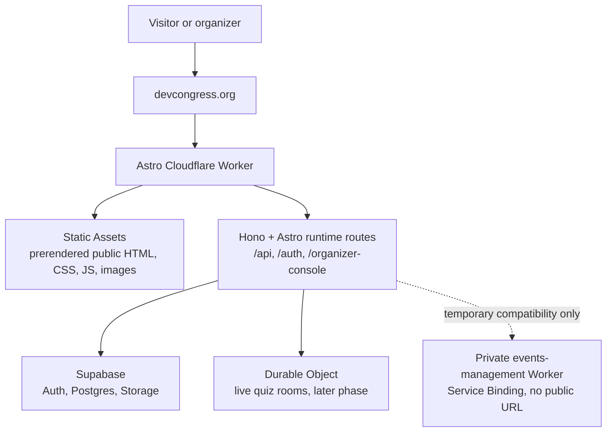

# Website + Events Management Integration Architecture

**Status:** Proposed for approval

**Date:** 2026-07-10

**Parent product:** `devcongress/website`

**Migration source:** `devcongress/events-management`

## Outcome

`devcongress.org` becomes the single public and organizer-facing product:

- Visitors keep the current Astro website, visual design, URLs, metadata, and static-first performance.
- Organizers sign in and operate under the same domain.
- Browser code no longer fetches a public `events-management` API origin.
- Organizer-owned data and public community features share one server-side data layer and update coherently.
- `events-management` remains available as a rollback/reference system until every migrated vertical slice passes parity checks.

No website repository changes are part of this planning checkpoint.

## Platform Decision

### Recommended Cloudflare shape

Use **one Cloudflare Worker with Static Assets** as the website origin.

This is the current equivalent of the requested “Pages + Workers” outcome:

- Cloudflare Static Assets supplies the Pages-like static delivery path.
- Worker compute handles only organizer, auth, API, and deliberately dynamic community routes.
- The public site remains an Astro static build by default.
- Static asset matches bypass application code; dynamic routes fall through to the Worker.

A literal Cloudflare Pages + Pages Functions deployment is not the recommended target. Astro 6 removed Cloudflare Pages support from `@astrojs/cloudflare`, and both Astro and Cloudflare now direct new full-stack Astro projects to Workers. Starting on Pages would create a second hosting migration as soon as organizer routes arrive.

Primary platform references:

- [Astro Cloudflare deployment guide](https://docs.astro.build/en/guides/deploy/cloudflare/)
- [Astro Cloudflare adapter and Astro 6 migration notes](https://docs.astro.build/en/guides/integrations-guide/cloudflare/)
- [Astro on-demand rendering](https://docs.astro.build/en/guides/on-demand-rendering/)
- [Cloudflare Worker + Static Assets routing](https://developers.cloudflare.com/workers/static-assets/routing/worker-script/)
- [Cloudflare Service Bindings](https://developers.cloudflare.com/workers/runtime-apis/bindings/service-bindings/)

### Rendering rule

Keep Astro in its default `output: 'static'` mode. Add `export const prerender = false` only to routes that require runtime behavior. Do not switch the whole site to `output: 'server'`.

## Target Topology

The final state should not need the private compatibility binding. It exists only as a rollback-friendly bridge if moving the current Hono route groups directly would make the organizer cutover too large.

## Meaning of “No External API”

For this integration, the requirement means:

- no browser request to `events-management.pages.dev` or another community API domain;
- no `EVENTS_MANAGEMENT_ORIGIN`, forced API base URL, or cross-origin credential flow in the final website;
- website UI calls only relative same-origin paths such as `/api/auth/session` and `/api/events`;
- website build/runtime owns the public data contract and organizer API facade;
- an optional migration bridge uses a private Cloudflare Service Binding, not a public HTTP origin.

Supabase and Google OAuth remain server-side platform dependencies. Removing every external service would be a separate product rewrite and is not implied by removing the external Events Management API.

## Static and Dynamic Boundary

| Surface | Rendering | Data owner | Worker invoked? |
|---|---|---|---|
| Marketing content, mission, programs, partners, admins | Prerendered | Astro content collections/YAML | No |
| Global navigation for anonymous visitors | Prerendered | Astro | No |
| Organizer session state in navigation | Tiny progressive client enhancement | Same-origin `/api/auth/session` | Once per page session |
| Organizer console and auth callback | On demand | Supabase + server modules | Yes |
| Organizer mutations | Same-origin Hono endpoints | Supabase | Yes |
| Meetup archive/detail after organizer move | On demand with edge caching | Supabase community events | Yes on cache miss |
| Homepage meetup preview after organizer move | Server island or same-footprint client enhancement | Same-origin public data module | Only for the dynamic fragment |
| Live quiz | On demand/realtime | Durable Object + Supabase durability | Yes |

This resolves the central tension: stable public content remains genuinely static, while organizer-owned content becomes fresh without rebuilding the entire website after every change.

## Runtime and Code Ownership

### Website repository owns

- public Astro pages and content collections;
- the global public navigation and session-aware organizer actions;
- `/organizer-console/**` routes and organizer UI shell;
- the same-origin Hono/Worker entrypoint;
- auth callback, session, logout, and authorization middleware;
- public and organizer API contracts;
- server-side Supabase repositories used by migrated features;
- Cloudflare build, preview, environment, custom-domain, and rollback configuration.

### Events Management repository owns during migration

- reference behavior and regression tests for features not yet moved;
- compatibility Worker routes for any temporarily service-bound feature;
- migration/export utilities needed to prove data parity;
- no new public integration contract once the equivalent route is owned by the website.

### Shared infrastructure remains

- Supabase Auth, Postgres, and Storage;
- Cloudflare-managed DNS for `devcongress.org` (already confirmed);
- Durable Objects for live coordinated state when the quiz moves.

## Supabase System-of-Record Plan

Yes: Supabase is the target database for all durable dynamic behavior in this integration.

The audited live-state inventory, schema gaps, row-count baseline, relational target, and migration waves are maintained in [supabase-foundation.md](./supabase-foundation.md).

The boundary is deliberate:

| Concern | Target owner |
|---|---|
| Organizer identity and OAuth | Supabase Auth |
| Organizer memberships, sessions, roles, and audit history | Supabase Postgres |
| Events, schedules, talks, speakers, CFP, and intake links | Supabase Postgres |
| Attendance imports and attendee records | Supabase Postgres |
| Feedback campaigns, questions, and responses | Supabase Postgres |
| Community profiles, score events, and leaderboard history | Supabase Postgres |
| Quiz definitions, sessions, participants, answers, and final results | Supabase Postgres |
| Live quiz timer/phase/room coordination | Cloudflare Durable Object, persisted to Supabase at durable boundaries |
| Covers, photos, slide decks, and other uploads | Supabase Storage with Postgres metadata |
| Stable mission/program/partner/admin/site copy | Repository content collections/YAML |
| Request/HTML caching | Cloudflare cache; never a source of truth |

### Relational target

Replace each `app_json_documents` whole-array document with domain tables. The exact schema is designed per slice, but the expected shape includes:

- `community_events` plus child schedule/media records;
- `talks`, `speakers`, and explicit event/talk/speaker relationships;
- `speaker_submissions` and `speaker_intake_links`;
- `event_checklist_items`;
- `attendance_imports` and normalized attendance records;
- `feedback_campaigns`, `feedback_questions`, and `feedback_submissions`;
- `admin_memberships`, `admin_sessions`, and `admin_audit_log`;
- `community_profiles` and append-oriented score/activity records;
- `quiz_sessions`, `quiz_questions`, `quiz_participants`, and `quiz_answers`.

Use JSONB only for genuinely flexible nested metadata, not as a replacement for tables or as one whole mutable array per domain.

### Database rules

- Use primary keys, foreign keys, unique/check constraints, and timezone-aware timestamps.
- Index every foreign key and the common route filters such as event, slug, status, start time, membership email/status, and session expiry.
- Keep browser access indirect through same-origin website routes. Do not expose the service-role key or allow anonymous writes.
- Use least-privilege grants and RLS where browser/anon Supabase access is ever introduced; application authorization still stays server-enforced.
- Prefer row-level atomic inserts/updates/upserts over read-modify-write document replacement.
- Keep transactions short and never hold a database lock while calling Luma, Google, or another network service.
- Make migrations additive and rollback-compatible until the old feature slice is retired.

### Migration method per domain

1. Create the relational tables, constraints, indexes, and access policies.
2. Backfill rows from the current dedicated table or `app_json_documents` document.
3. Verify counts, identifiers, relationships, representative records, and timestamps.
4. Switch the new website module to relational reads.
5. Designate one writer, then switch writes to the relational repository.
6. Compare old/new public and organizer responses during the rollback window.
7. Remove the compatibility document only after the feature has no remaining readers or writers.

This makes Supabase—not the website build, Cloudflare cache, Worker memory, local files, or Durable Object storage—the durable product source of truth.

## Backend Integration Strategy

Astro 6 supports a custom Hono entrypoint through `astro/hono` and `@astrojs/cloudflare/hono`. Use that to compose API routes and Astro page handling inside the same Worker.

Do not copy `server/app.ts` wholesale. It is a large mixed route file and imports compatibility paths that are inappropriate for a clean website runtime. Move route groups as bounded modules:

1. auth/session/organizer authorization;
2. organizer memberships and audit log;
3. community events and public meetup projections;
4. event checklist, speakers, talks, and speaker intake;
5. attendance and Luma imports;
6. feedback and media;
7. leaderboard/account compatibility domains;
8. quiz builder and live quiz coordination.

Each module exposes its Hono routes, schema validation, server-side repository, and focused tests. The website Worker mounts the module before Astro's page middleware.

### Runtime exclusions

The following code must be replaced or isolated rather than copied into the Worker path:

- `server/index.ts` and all `Bun.serve`/`Bun.file` behavior;
- local filesystem fallback reads/writes in `lib/mock-db/index.ts`;
- unconditional `node:fs` or process-local persistence assumptions;
- synchronous/local `pdf-parse` quiz imports;
- process-local write queues as a concurrency guarantee.

Hosted data is currently available from Supabase, so these exclusions do not require throwing away production data. The Supabase `app_json_documents` bridge may remain temporarily, but each feature should move to dedicated tables when its schema and query patterns justify it.

## Organizer UI Strategy

Preserve the existing organizer experience without imposing its dark console styling on the public website.

Recommended first move:

- extract a small Vue organizer application and mount it only under `/organizer-console/**` through Astro's Vue integration; do not copy individual views without their router/query/shared-component dependencies;
- keep it route-split so no Vue runtime or organizer CSS ships on normal public pages;
- keep the current phone-limited organizer behavior;
- preserve the existing Google OAuth, HTTP-only session, role, origin-check, and audit behavior;
- gradually refactor screens only after functional parity.

The public UI change is intentionally small:

- add `Organizer` to the homepage desktop and mobile actions;
- add the equivalent action to the separate meetup archive/detail headers if organizer access must be global;
- render `Sign out` hidden by default and reveal it only after a successful same-origin session check;
- use one small shared organizer-actions component instead of refactoring the entire site header;
- keep motion limited to purposeful, interruptible transform/opacity transitions under 300 ms and respect reduced motion.

## Migration Sequence

### Gate 0 — Confirm the production source and platform interpretation

Before implementation:

- approve Worker with Static Assets as the modern interpretation of “Pages + Workers”;
- confirm production Cloudflare Builds should connect to `devcongress/website`, while development continues in the fork through PRs;
- select the exact website source commit for the migration branch;
- record the current production URL/content baseline separately from the local fork's newer event-data behavior.

### Phase 1 — Static Cloudflare parity

Goal: move hosting with no visitor-visible product change.

1. Keep the website fully static; do not add organizer routes or the Cloudflare adapter yet.
2. Add an assets-only Worker configuration for `dist/` and preserve custom 404/trailing-slash behavior.
3. Reproduce the current build inputs, Node/pnpm versions, analytics, fonts, canonical origin, scheduled rebuild behavior, and environment variables.
4. Deploy an unpromoted Worker preview while GitHub Pages remains production.
5. Crawl and visually compare `/`, `/meetups/`, every meetup detail route, assets, metadata, links, mobile behavior, and 404s.
6. Attach `devcongress.org` only after parity passes. Keep the GitHub Pages deployment available as the rollback origin during the soak period.

Exit criteria:

- no unexplained screenshot or DOM/content diff;
- URL/status/redirect parity passes;
- Core Web Vitals and asset bytes are no worse beyond agreed tolerance;
- analytics and scheduled refresh behavior work;
- one-command/version rollback is documented and tested.

### Phase 2 — Same-origin runtime spine

Goal: add compute without changing public rendering defaults.

1. Reconcile live Supabase migration history/schema with `main` and regenerate canonical database types.
2. Add `@astrojs/cloudflare` while retaining `output: 'static'`.
3. Add the Hono custom entrypoint and explicit Worker-first routes only for `/api/*`, `/auth/*`, and `/organizer-console/*`.
4. Add isolated preview/staging bindings and secrets; previews must never write to production Supabase data.
5. Port `/api/health`, `/api/auth/session`, OAuth callback/exchange, and `/api/auth/logout`.
6. Port a protected, read-only organizer event list backed by `community_events` to prove authorization and data access without introducing a write path.
7. Add the session-aware Organizer/Sign out actions without changing other website layout or styling.

Exit criteria:

- ordinary public asset requests do not execute application code;
- anonymous and authenticated navigation states work without layout shift;
- cookies, origin checks, role checks, and logout pass on the stable staging origin;
- no cross-origin Events Management request is used by the migrated auth slice.

### Phase 3 — Organizer vertical slices

Goal: make the website the complete organizer home before public community features move.

Move and verify in this order:

1. organizer shell, memberships, roles, and audit log;
2. event list/create/edit/publish plus public meetup projection;
3. talks, speakers, CFP decisions, and speaker intake after replacing unsafe whole-array write paths;
4. checklist, Luma preview/import, and attendance after their relational backfills;
5. feedback campaigns, responses, and event media;
6. quiz builder/host controls after the data/runtime model is ready.

For every slice:

- website UI and same-origin API land together;
- production data is read through Supabase, never local JSON files;
- old and new responses are contract-compared;
- writes use idempotency or a single designated writer during overlap;
- the old route remains rollback-capable until the slice is accepted;
- the public projection is verified immediately after an organizer mutation.

### Phase 4 — Remove the external meetup dependency

Goal: organizer edits and public event views share one source without a rebuild-only contract.

1. Move `getMeetups()` normalization into the website's server-side community-event module.
2. Complete relational talks/speakers and build one public event projection so organizer writes and visitor reads cannot diverge.
3. Remove `EVENTS_MANAGEMENT_ORIGIN` and remote asset-origin rewriting.
4. Render meetup archive/detail routes from the colocated Supabase repository with edge caching.
5. Keep stable marketing content prerendered.
6. Ensure the homepage meetup section has a fixed-footprint dynamic path so data can update without layout shift.

Exit criteria:

- no browser or build request targets `events-management.pages.dev`;
- an organizer publish/update is visible through the website within the agreed freshness window;
- YAML remains only an intentional editorial fallback/seed path, not a competing production source of truth.

### Phase 5 — Pull in community features one by one

Recommended order balances public value against runtime complexity:

| Order | Feature slice | Why here |
|---:|---|---|
| 1 | Rich event archive, schedules, system-design recaps, media | Read-heavy and already close to the website's current purpose |
| 2 | CFP discovery/submission and speaker intake | Clear public-to-organizer workflow |
| 3 | Event feedback and community event proposals | Bounded writes with visible organizer moderation |
| 4 | Speaker/talk archive and slide/recording resources | Extends the durable knowledge archive |
| 5 | Leaderboard and profile/claim flows | More identity and compatibility-state work |
| 6 | Live quiz player flow | Highest coordination risk; move with Durable Objects rather than JSON polling state |

Every feature is a complete vertical slice: public route, organizer controls, same-origin endpoint, storage, auth/rate limits, analytics, tests, documentation, and rollback.

Community event proposals are a later candidate from the unmerged `feature/community-event-submissions` branch, not current `main` parity scope.

### Phase 6 — New community-version features

New work begins only after the migrated ownership boundary is stable. New features should:

- live in the website repository from inception;
- use the shared server modules and same-origin contracts;
- preserve static-first rendering by default;
- choose Durable Objects only for coordinated live state;
- choose Supabase tables/storage for durable product data;
- avoid adding a new public backend origin.

### Phase 7 — Retire superseded Events Management surfaces

Retirement requires:

- all selected routes and workflows accepted on `devcongress.org`;
- no website build/runtime references to the old origin;
- no unique production writes hitting the old Worker;
- data counts and representative records reconciled;
- auth, audit, media, attendance, feedback, and quiz retention checked;
- rollback window completed;
- old Worker changed to read-only/redirect mode before final shutdown;
- repository archived only after operational sign-off.

## Environment and Security Requirements

- Separate local, preview/staging, and production bindings.
- Preview builds must use a non-production Supabase project or strictly isolated schema/resources.
- Keep `SUPABASE_SERVICE_ROLE_KEY` and OAuth provider secrets server-only.
- Use `HttpOnly; Secure; SameSite=Lax; Path=/` for the final same-origin organizer cookie unless a narrower reviewed policy is required.
- Preserve membership allowlisting, owner/organizer roles, origin validation, rate limiting, Turnstile where applicable, and audit logging.
- Fail closed in production if Supabase organizer auth configuration is missing; never enable the local default password/session fallback on hosted website environments.
- Protect stable staging auth URLs; ordinary ephemeral preview URLs are not suitable OAuth callback origins.
- Do not enable Worker-first handling globally. Route it only where runtime behavior is required.

## Cutover and Rollback

The domain is already on Cloudflare nameservers, so a Worker Custom Domain is available without a nameserver migration.

Cutover:

1. freeze content/config changes briefly;
2. build both old and candidate outputs from the approved source commit;
3. run the parity suite against both origins;
4. attach the Worker Custom Domain;
5. smoke test from multiple networks/devices;
6. monitor 4xx/5xx, Worker exceptions, auth callbacks, asset misses, and analytics;
7. keep GitHub Pages deployable during the soak window.

Rollback:

1. detach or roll back the Worker version/custom-domain target;
2. restore the prior GitHub Pages DNS records/origin;
3. leave Supabase schema changes additive so old code still reads them;
4. disable only new writers if dual-write or contract incompatibility is detected;
5. preserve logs and failed request samples for diagnosis.

## Decisions Needed Before Website Work

1. Approve **Worker with Static Assets** instead of a literal new Pages project.
2. Confirm production deploys should be owned by `devcongress/website`, with `/Users/TT/Documents/personal/forks/website` remaining the development fork.
3. Select the exact website source commit for the Phase 1 parity deployment.
4. Confirm Organizer/Sign out actions should appear on meetup archive/detail headers as well as the homepage.
5. Define the freshness target for organizer-published event changes (recommended: visible within five minutes, with explicit cache invalidation where practical).
