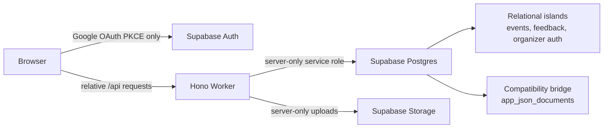
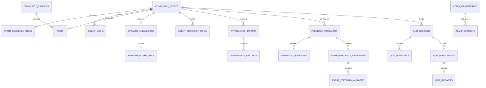

# Supabase Foundation for the Website Integration

**Status:** Current-state audit and proposed target

**Audit date:** 2026-07-10

**Live project:** `cmmxjodcxzgrzvkapbin`

## Decision

Supabase is the durable system of record for every dynamic organizer and community domain in the combined product.

- Supabase Auth owns organizer identity and Google OAuth.
- Supabase Postgres owns durable application records and relationships.
- Supabase Storage owns uploaded media; Postgres owns its metadata and lifecycle.
- Cloudflare Workers run same-origin application logic but do not own durable data.
- Durable Objects coordinate transient live quiz rooms but persist definitions, participation, answers, scores, and final state to Supabase.
- Repository content collections/YAML remain only for stable editorial website content.

This uses Supabase as a complete Postgres platform rather than treating it as a remote JSON-file host. Supabase documents that every project provides a full Postgres database underlying Auth and Storage, while RLS protects tables exposed through its API.

References:

- [Supabase database overview](https://supabase.com/docs/guides/database/overview)
- [Supabase Row Level Security](https://supabase.com/docs/guides/database/postgres/row-level-security)
- [Supabase database migrations](https://supabase.com/docs/guides/deployment/database-migrations)
- [Supabase Storage access control](https://supabase.com/docs/guides/storage/security/access-control)

## How the Existing Project Uses Supabase

The browser currently uses the Supabase client only to start Google OAuth, exchange the callback code, and hand the temporary access token to Hono. Hono then creates the app-owned HTTP-only `devcon_admin` session and all product data uses relative `/api/*` routes.

Configured runtime inputs are:

- browser-safe `VITE_SUPABASE_URL` and `VITE_SUPABASE_ANON_KEY`;
- server-only `SUPABASE_SERVICE_ROLE_KEY`;
- `APP_DATA_SOURCE=supabase` in the deployed Worker;
- `PUBLIC_APP_URL`/`PUBLIC_FRONTEND_ORIGIN` for callback and origin validation.

The service-role key stays server-only. Supabase notes that service keys bypass Storage RLS and must never be shared publicly.

## Live Project Snapshot

The following was verified through read-only Supabase REST/Auth/Storage requests. No row bodies, emails, tokens, attendee data, or object names were printed.

### Postgres

| Table | Live rows | Current role |
|---|---:|---|
| `community_events` | 9 | Relational event source and public meetup projection |
| `event_submissions` | 0 | Future community/partner proposal inbox; live schema is ahead of `main` |
| `feedback_testers` | 3 | Legacy product-feedback tester directory |
| `feedback_submissions` | 16 | Mixed product feedback and event survey responses |
| `feedback_campaigns` | 11 | Event feedback campaign configuration |
| `feedback_questions` | 64 | Campaign questions |
| `admin_memberships` | 9 | Organizer allowlist and roles |
| `admin_sessions` | 41 | App-owned organizer sessions |
| `admin_audit_log` | 220 | Organizer security/action ledger |
| `app_json_documents` | 11 | Temporary whole-array compatibility documents |

Live aggregate details:

- Community events: 9 published official events; 6 completed, 2 upcoming, and 1 CFP-closed.
- Event JSON currently embeds 53 schedule items and 25 photos, but zero embedded speakers and zero videos.
- Feedback: 11 event-survey responses and 5 route/product feedback entries.
- Three feedback campaigns currently reference event identifiers that do not match a `community_events.id`; do not add an event foreign key until those records are mapped.
- Organizer access: 1 owner and 8 organizers, all active.
- Sessions: 15 revoked and 1 currently unrevoked/unexpired; expired/revoked retention needs an explicit cleanup policy.

### Anonymous read boundary

The configured anon key was independently verified as valid for PostgREST. RLS/grants expose only intended public rows:

| Table | Anonymous result |
|---|---|
| `community_events` | 9 published rows visible |
| `feedback_campaigns` | 4 active rows visible |
| `feedback_questions` | 35 questions belonging to active campaigns visible |
| `feedback_testers` | 3 active rows visible |
| Admin tables | Permission denied |
| `app_json_documents` | Permission denied |
| `event_submissions` | Permission denied |
| `feedback_submissions` | Permission denied |

The website target still keeps data access behind same-origin Worker routes. Existing RLS remains defense in depth and supports public projections, not a reason for client code to query Supabase directly.

### Storage and Auth

- Google and email Auth providers are enabled; organizer access is still gated by `admin_memberships`.
- `meetup-media` is the only bucket.
- The bucket is public, limited to 5 MiB objects, and accepts AVIF, JPEG, PNG, and WebP.
- It currently contains 3 objects.
- Uploads use the server service role; only public reads have an anon/authenticated Storage policy.

## Compatibility-Document Inventory

The compatibility inventory below records domains that were originally stored as one JSON array per row. Rows marked implemented are no longer hosted writers; their documents remain only as backfill and rollback evidence:

| Key | Live records | Target |
|---|---:|---|
| `event-attendance-imports` | 6 | `attendance_imports` + `attendance_records` |
| `event-checklists` | 53 | `event_checklist_items` |
| `speaker-intake-links` | 2 | Implemented by `20260728020000_security_hardening.sql` as hash-only `speaker_intake_links` |
| `speakers` | 1 | `people`/`community_profiles` + event/talk relationships |
| `talks` | 1 | `talks` + speaker/event foreign keys |
| `speaker-submissions` | 0 | Implemented by `20260728020000_security_hardening.sql` as relational `speaker_submissions` |
| `questions` | 0 | Implemented by `20260801010000_relational_quiz_runtime.sql` as relational `quiz_questions` |
| `quiz-participants` | 0 | Implemented by `20260801000000_quiz_participants.sql` as relational `quiz_participants`; the compatibility row remains only for rollback/backfill evidence |
| `quiz-sessions` | 0 | Implemented by `20260801010000_relational_quiz_runtime.sql` as relational `quiz_sessions` |
| `responses` | 0 | Implemented by `20260801010000_relational_quiz_runtime.sql` as relational `quiz_responses` |
| `users` | 0 | `community_profiles` + identity/merge records |

This bridge is durable but unsafe as a final multi-writer store:

- every mutation replaces the entire domain array;
- serialization exists only inside one JavaScript isolate;
- there is no revision predicate, row lock, or compare-and-swap;
- concurrent Workers can overwrite each other's changes;
- hosted reads and writes now fail closed when the Supabase runtime is unavailable or misconfigured;
- attendance documents embed sensitive attendee records inside one large value.

The bridge may remain read-only during migration, but it must not be copied into the final website Worker as the long-term repository.

## Current Strengths to Keep

### Organizer auth

The existing pattern is sound:

1. Supabase/Google proves identity.
2. `admin_memberships` grants product access and role.
3. Hono stores only a hash of an opaque app session token.
4. The browser receives an HTTP-only same-origin cookie.
5. Organizer mutations enforce app session, role, and request origin.
6. Successful security-sensitive actions write `admin_audit_log` rows.

Keep this model when the organizer UI moves to the website origin.

### Events

`community_events` already provides the first safe organizer slice:

- stable UUIDs and unique slugs;
- lifecycle status and publication flag;
- Luma/external identifiers;
- schedule/media JSON suitable for transitional reads;
- public RLS limited to published rows;
- indexes for publication/status/date queries.

### Feedback

Campaigns, questions, submissions, response-token deduplication, and public active-campaign policies already exist relationally. They need consistency hardening, not wholesale replacement before the first website slice.

## Gaps That Must Be Reconciled

### 1. Live schema was ahead of `main` (reconciled in code)

Live Supabase contains:

- `event_submissions`;
- `community_events.event_classification`.

Those objects are absent from current `main` but exist on `feature/community-event-submissions`. The table is empty, while all nine current events are classified `official`.

`20260801020000_community_event_submissions.sql` takes the replacement path: it upgrades the empty hosted `event_submissions` table additively, removes the obsolete all-`official` `event_classification` column, and replaces it with independent ownership, series, format, source, moderation, and publication fields. Apply and verify that migration before enabling the website form.

The original decision point was:

- adopt the feature schema into the canonical migration history and checked-in types; or
- add a new migration that deliberately removes/replaces it.

Do not leave a production-only schema that the repository cannot reproduce.

### 2. Migration history is not reproducible yet

- There are 11 committed SQL files but only 10 distinct timestamp versions.
- `20260616000000_admin_auth.sql` and `20260616000000_luma_event_imports.sql` collide.
- There is no committed `supabase/config.toml`, `seed.sql`, schema snapshot, or CI migration replay/type-generation check.

Supabase applies migrations in timestamp order and compares local files with `supabase_migrations.schema_migrations`. Reconcile the remote ledger with `supabase migration list`/`db pull`/`migration repair` before creating the website's first database migration. Do not rename or replay already-applied files blindly.

### 3. Checked-in database types are an application shim

`types/supabase.ts` does not currently describe the live `event_submissions` table or `event_classification` field on `main`. It also omits some known relationships/functions and uses weak array types for JSONB domains.

After migration reconciliation:

- generate types from the canonical schema;
- commit them;
- add a CI drift check;
- avoid fallback branches that silently tolerate missing live columns.

### 4. Events and public talks have two sources

`/api/public/meetups` projects from `community_events`, including its embedded `speakers` array. Archive/talk routes and organizer talk workflows read the separate `talks`/`speakers` compatibility documents.

Today an organizer can update a talk without guaranteeing the website meetup projection changes. Relational talks/speakers must land before the external meetup dependency is removed.

### 5. Feedback integrity needs a migration

- `feedback_campaigns.event_id` and `feedback_submissions.event_id` are text, not event foreign keys.
- Three live campaigns do not map to current community event UUIDs.
- `feedback_submissions.campaign_id` lacks an index.
- Campaign question replacement deletes then reinserts outside one transaction.
- Route feedback and event survey responses share one table and duplicate structured answers into the text `message` column.
- Public tester selection currently grants row-level reads of the whole `feedback_testers` row, which includes optional email; replace it with a safe public projection or stop exposing tester records directly.

Map the three legacy campaign identifiers first, then split or normalize product feedback and event-response data with proper event/campaign/question relationships.

### 6. Organizer session hardening

- Session rows snapshot role/email; validation checks current membership status but can continue using an old role until session expiry.
- Join current membership role for authorization or revoke sessions on every role/status change.
- Add missing foreign-key indexes and expired/revoked session cleanup.
- Throttle `last_seen_at` updates instead of writing on every protected request.
- Hosted website environments must fail closed when Supabase auth configuration is missing.

### 7. Speaker intake bearer tokens

`20260728020000_security_hardening.sql` replaces the compatibility records with private relational rows that store only `token_hash`. Raw tokens are returned once at issuance and never persisted; migrated legacy links are deliberately expired and must be reissued.

### 8. Media lifecycle

Event rows currently store public URLs, but there is no media metadata table, ownership/audit record, or orphan cleanup.

Add `event_media` with event FK, bucket, object path, kind, MIME type, size, alt text, order, actor, and timestamps. Use versioned cover paths or explicit cache invalidation so organizer updates meet the freshness target.

## Target Data Model

JSONB remains appropriate for genuinely flexible leaf metadata such as compact audit details, external-resource descriptors, or a typed answer payload. It is not the container for an entire mutable domain.

## Migration Waves in the Grand Scheme

### S0 — Reconcile the foundation

- Compare remote migration history with committed files.
- Resolve the duplicate migration version without corrupting applied history.
- Adopt or deliberately remove the live event-submission/classification schema.
- Add reproducible Supabase config, local reset, migration lint/replay, and generated-type CI.
- Make the hosted runtime fail closed on Supabase errors.

This is the database prerequisite for dynamic website work, but it does not block the initial static Cloudflare parity deployment.

### S1 — Reuse auth and events

- Move organizer Auth/session/membership/audit modules to the website Worker.
- Move read-only organizer event list and public event projection.
- Keep `community_events` as the current event root.
- Add missing indexes, public projection/view boundaries, session cleanup, and role-change revocation.

This is the first safe dynamic website slice.

### S2 — Relationalize public program content

- Create/backfill talks, profiles/people, event speakers, speaker submissions, and hash-only intake links.
- Add schedule/resource and media metadata where independent editing/querying requires rows.
- Switch organizer writes and public archive/meetup projections to these tables.
- Designate the website Worker as the only writer before removing old readers.

This wave must complete before removing `EVENTS_MANAGEMENT_ORIGIN`.

### S3 — Relationalize organizer operations

- Create/backfill checklist items.
- Create attendance import metadata and normalized attendee records.
- Apply explicit PII retention/access rules.
- Move Luma/attendance screens only after backfill and count reconciliation.

### S4 — Harden feedback

- Map legacy event identifiers.
- Separate product feedback from event survey responses.
- Add event/campaign/question foreign keys and indexes.
- Make campaign/question changes transactional.
- Replace isolate-local throttling with a durable shared limiter.

### S5 — Community identity and reputation

- Create community profiles and identity-link records.
- Model merges explicitly.
- Use append-oriented participation/score events and derive leaderboard totals.

### S6 — Quiz and realtime

- Completed: relational quiz sessions, questions, participants, answers, room scores, unique session codes, question order, participant membership, and one answer per participant/question.
- Completed: atomic PostgreSQL answer/scoring and presenter state transitions, plus database-owned aggregate state.
- Remaining: add a secured Realtime broadcast boundary when participant-scoped authorization exists; do not expose answer-bearing tables directly to anonymous clients.
- Reconsider a Durable Object only if measured active-room coordination exceeds the relational transaction model rather than making it a second source of truth preemptively.

### S7 — Retire compatibility storage

For each `app_json_documents` key:

1. export and transform;
2. backfill relational rows;
3. reconcile counts, IDs, relationships, and representative records;
4. switch reads;
5. establish one writer;
6. switch writes and compare API projections;
7. remove the document only when no readers/writers remain.

Do not dual-write whole JSON documents from the old and new Workers.

## Website-Phase Integration

| Website phase | Supabase requirement |
|---|---|
| Static Cloudflare parity | No database mutation; current build behavior can remain temporarily |
| Same-origin runtime spine | S0 complete; reuse relational auth and read-only events |
| Organizer event CRUD | S1 complete and website Worker designated as the event writer |
| Talks/speakers/CFP organizer slices | Corresponding S2 tables/backfill complete first |
| Remove external meetup API | S2 public projection unified and verified |
| Attendance/checklist UI | Corresponding S3 tables/backfill complete first |
| Feedback community slice | S4 integrity and transactional updates complete |
| Leaderboard/profiles | S5 complete |
| Live quiz | S6 relational durability plus Durable Object coordination |

## Verification Contract

Every migration wave must prove:

- migrations replay from an empty local database;
- checked-in types match the resulting schema;
- RLS/grants expose only intended public projections;
- service-role access remains Worker-only;
- every foreign key used for joins/deletes has an index;
- backfill counts match the source document/table;
- IDs, timestamps, status, and representative records reconcile;
- old/new API responses are contract-compared;
- one writer is designated during cutover;
- rollback remains additive until the soak window ends;
- no raw bearer tokens, secrets, or unnecessary attendee PII are copied.
